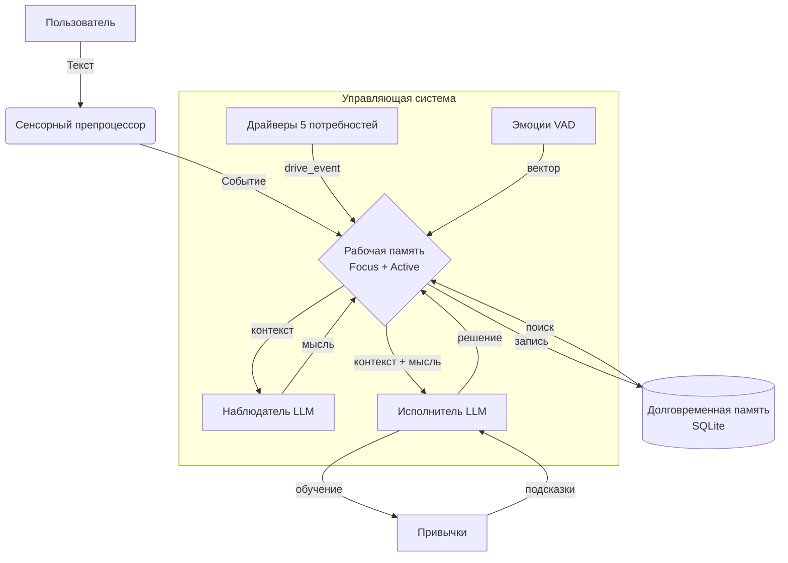

# MVP Архитектура

## Упрощённая схема

## Поток данных MVP

1. **Вход**: текст пользователя → препроцессор (важность, тональность)
2. **Рабочая память**: событие в Focus
3. **Драйверы**: обновляют уровни, при пороге → `drive_event`
4. **Эмоции**: обновляют VAD по правилам
5. **Цикл**:
   - Контекст из Focus + Active
   - Наблюдатель → мысль
   - Исполнитель → реплика или действие
6. **Память**: запись эпизода в SQLite
7. **Обучение**: обновление силы привычки

## Упрощения для MVP

| Аспект | Полная версия | MVP |
|--------|---------------|-----|
| Рабочая память | Focus + Active + Background | Focus + Active |
| Эмбеддинги | Sentence transformer | Без эмбеддингов |
| Поиск в LTM | Векторный (LanceDB) | Текстовый (SQLite FTS) |
| Привычки | С автовыполнением | Только подсказки |
| Глубина диалога | Со счётчиком и лимитом | Без лимита |
| Прерывания | Стек состояний | Без прерываний |
| MCP | Интеграция | Отложено |

## Технические решения MVP

| Компонент | Технология |
|-----------|------------|
| Язык | TypeScript/Node.js |
| Рабочая память | In-memory массив |
| Долговременная память | SQLite с FTS5 |
| LLM | Локально (Ollama) или облако |
| EventBus | EventEmitter (Node.js) |

---

**См. также:**
- [MVP Компоненты](mvp-components.md) — детальное описание
- [MVP Контракты](mvp-interfaces.md) — интерфейсы для реализации

---

**Навигация:**
[← MVP Оглавление](README.md) | [Компоненты →](mvp-components.md)
